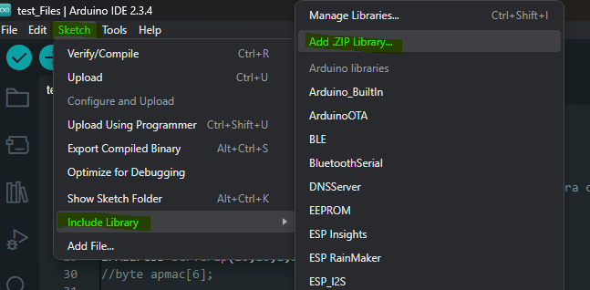

# FakeAPlib

Librerría personal donde se incluirán todas las dependecias y librerías externas para el desarollo de un punto de acceso falso con un`ESP32-WROVER-E`. 

Les invitamos a consultar la [documentación](./documentation/html/index.html) del código completo para obtener más detalles sobre el mismo. 

## Configurar el entorno

Se tendrá que descargar esta librería y añadirla a `Arduino IDE` como una librería externa. Una vez hecho eso, se podrá usar en cualquier proyecto arduino en el equipo. 
Ruta para añadir librerías externas: ``Sketch -> Include library -> Add .ZIP  Library...``

Encontrarán en el siguiente enlace los pasos detallados para poder hacerlo: [Cómo instalar una librería de Arduino en el entorno de desarrollo](https://programarfacil.com/blog/arduino-blog/instalar-una-libreria-de-arduino/)

Encontrarán ejemplos de uso de esta libreria en la carpeta [examples](./examples/). 

## Dependencias
Las siguientes librerías se tienen que descargar previamente a la compilicación del cógigo:
* SD_MMC.h
* FS.h
* UrlEncode.h

Se han selecionado librerias que están disponibles en el gestor de librería del `Arduino IDE`. Solo se tendrán que buscar y descargar.